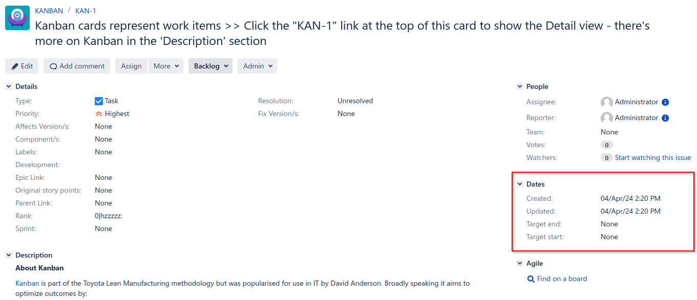

# Documentation

## Description

This "Hiding sections and fields" plugin allows you to hide part of the data from users depending on the type of issue, the role of the project, the user group and JQL conditions. The plugin hides fields and sections in the forms for viewing, creating and editing queries, field data in the search table, as well as information on widgets in the form of tables on the Dashboard. It can hide both entire sections and certain elements using the HTML selector, which allows you to hide even items in the selection of the connection of one query with another. The plugin has the flexibility to create rules for each project and task type separately.

### Plugin Features

The rules are "Marked in yellow"

* You can specify one or more types of issues for which the rule will be applicable
* You can specify one or more project roles
* You can specify one or more groups
* You can specify a JQL condition under which the rule will be applied

Fields or sections are "Marked in blue"

* You can specify one or more sections that should be hidden
* You can specify one or more fields that should be hidden
* You can specify one or more fields that should be read-only
* You can specify a CSS selector to hide an HTML element

## Plugin Installation

1. To install the plugin, navigate to the "Atlassian Marketplace" page via the link: <https://marketplace.atlassian.com>
2. Search for the "Hiding sections and fields" plugin by "ALS Development".
3. Click the "Try it free" button to start a free trial period.
4. For manual installation, download the plugin in the "Versions" section.

## Usage

---

## Example of hiding the "Dates" data block

The issue view form consists of sections with fields and action buttons.
In this example, we will hide the "Dates" section, for this we can use the "Sections to hide" setting.
In this setting, there are not only blocks, but also action buttons, which can also be hidden.

### Adding a setting

### View in the settings tables

### View before enabling the setting

### View after enabling the setting

As we can see, after enabling the setting, the block with dates was hidden.

---

## Example of hiding the "Labels" field

In this example, we will hide the field with a small rule, for this we can use the "Fields to hide" setting. 
We need all issues with the "Bug" type to have the "Labels" field hidden

### Adding a setting

### View in the settings tables

### The representation on the issue is outside the rule

### The view on the issue for which the rule applies

As we can see, the rule was applied only for issues with the "Bug" type

---

## Example of hiding a value in the "This issue" field of the "Link" form

In this example, we will hide the "clones" value of the "This issue" field with a small rule.
All issues with the "Bug" type should have the "clones" value hidden, for the rest it should be available.

### Adding a setting

### View in the settings tables

### The representation on the issue is outside the rule

### The view on the issue for which the rule applies

As we can see, the rule was applied only for issues with the "Bug" type

---

## Example of read-only access to the "Priority" field

In this example, we will make the field read-only with a small rule, for this we can use the "Fields to readonly" setting.
We need all issues with the "Bug" type to have the "Priority" field read-only.
When using this rule, the fields on the view form will be read-only, and they will be hidden in the edit form.

### Adding a setting

### View in the settings tables

### The representation on the issue is outside the rule

### The view on the issue for which the rule applies

As we can see, the rule was applied only for issues with the "Bug" type

---

## Example of adding multiple rules

In this example, two rules will be added. The first one will hide the "Assignee" field, and the second one will hide the "Priority" field.
We will see how the values will be displayed in the query search table using these rules.

### View in the settings tables

### View of the search table

As we can see, the rules worked correctly. For issues with the "Task" type, the data of the "Assignee" field is hidden, and for issues with the "Bag" type, the "Priority" field is hidden

---

## Example of using JQL

In this example, we will add a rule using JQL, which by convention will hide the "Assignee" field for us.
The "Assignee" field should be hidden only for those queries that have the value "TopSecret" in the "Labels" field.

### Adding a setting

### View in the settings tables

### View of the search table

As we can see, the rules worked correctly. For queries that have "Labels" with the value "TopSecret", the "Assignee" field is hidden.

